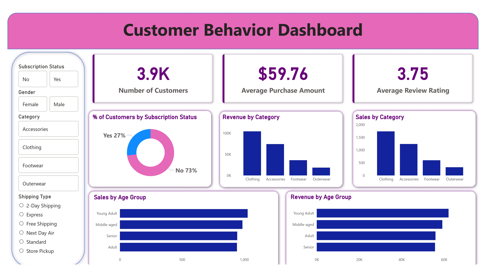

# 📊 Customer Shopping Behavior Analysis


---

## 📌 Project Overview
This project focuses on analyzing **customer shopping behavior** using **Python, SQL, Machine Learning, and Power BI**.  
It aims to identify purchasing patterns, customer segments, churn risk, and revenue contribution to support business decision-making.

---

## 🎯 Project Objectives
- Analyze customer purchasing behavior
- Segment customers using machine learning
- Identify high-value and churn-risk customers
- Visualize insights using interactive Power BI dashboards
- Support data-driven marketing and retention strategies

---

## 🚀 Quick Start

### Automated Setup (Recommended)

**On Linux/macOS:**
```bash
git clone https://github.com/sandeep12222300/Customer-Shopping-Behavior-Analysis.git
cd Customer-Shopping-Behavior-Analysis
chmod +x setup.sh
./setup.sh
```

**On Windows:**
```bash
git clone https://github.com/sandeep12222300/Customer-Shopping-Behavior-Analysis.git
cd Customer-Shopping-Behavior-Analysis
setup.bat
```

### Manual Setup

See detailed instructions in [docs/INSTALLATION.md](docs/INSTALLATION.md)

---

## 🛠️ Tech Stack
- **Python** (Pandas, NumPy, Scikit-learn)
- **SQL** (PostgreSQL)
- **Power BI**
- **Machine Learning** (K-Means clustering)
- **Jupyter Notebook**

---

## 📊 Power BI Dashboards

### 🔹 Page 1 – Customer Behavior Overview


**Insights Covered:**
- Total customers
- Average purchase amount
- Average review rating
- Revenue by product category
- Sales by age group
- Purchase behavior trends

---

### 🔹 Page 2 – Advanced Customer Insights & Segmentation


**Advanced Analytics:**
- Customer segmentation using ML
- Churn risk distribution
- Purchase frequency analysis
- Revenue contribution by segment
- Waterfall analysis of revenue impact

---

## 🤖 Machine Learning Component
- **K-Means clustering** used for customer segmentation
- Customers grouped based on:
  - Purchase amount
  - Purchase frequency
  - Previous purchase history
- Churn risk flag derived from behavioral metrics

---

## 🗄️ SQL Analysis
- Segment-wise revenue analysis
- Churn-risk customer identification
- Purchase frequency trends
- Customer value analysis for dashboards

---

## 📈 Business Impact
- Helps identify **high-value customers**
- Highlights **customers at churn risk**
- Improves targeting for promotions and retention
- Supports revenue optimization strategies

---

## 📋 Prerequisites
- Python 3.8 or higher
- PostgreSQL (for database integration)
- Power BI Desktop (for viewing dashboards)
- Git (for cloning the repository)

---

## 🚀 Installation & Setup

### 1. Clone the Repository
```bash
git clone https://github.com/sandeep12222300/Customer-Shopping-Behavior-Analysis.git
cd Customer-Shopping-Behavior-Analysis
```

### 2. Create Virtual Environment (Recommended)
```bash
# Create virtual environment
python -m venv venv

# Activate virtual environment
# On Windows:
venv\Scripts\activate
# On macOS/Linux:
source venv/bin/activate
```

### 3. Install Dependencies
```bash
pip install -r requirements.txt
```

### 4. Set Up Database (Optional)
If you want to use PostgreSQL integration:
- Install PostgreSQL
- Create a database
- Update database credentials in the notebook

---

## 🚀 How to Use

### Option 1: Jupyter Notebook Analysis
1. Navigate to the notebooks directory
2. Launch Jupyter:
   ```bash
   jupyter notebook
   ```
3. Open `Customer_Behavior_Analysis.ipynb`
4. Run all cells to perform the analysis

### Option 2: View Power BI Dashboard
1. Ensure you have Power BI Desktop installed
2. Open `dashboards/Customer_Behavior_Dashboard.pbix`
3. Explore interactive dashboards using slicers and filters

### Option 3: Run SQL Queries
1. Set up PostgreSQL database
2. Import the processed CSV data
3. Run queries from `sql/customer_behavior_sql_queries.sql`

---

## 📚 Documentation

Comprehensive documentation is available in the `docs/` directory:

- **[Installation Guide](docs/INSTALLATION.md)** - Detailed setup instructions with troubleshooting
- **[Data Dictionary](docs/DATA_DICTIONARY.md)** - Complete description of all datasets and columns
- **[Analysis Guide](docs/ANALYSIS_GUIDE.md)** - Methodology, interpretation, and business insights
- **[Database Integration](docs/DATABASE.md)** - PostgreSQL setup and SQL query guide

---

## 📁 Project Structure
```
Customer-Shopping-Behavior-Analysis/
├── data/                          # Dataset files
│   ├── customer_shopping_behavior.csv
│   └── customer_behavior_with_ml_segments.csv
├── notebooks/                     # Jupyter notebooks
│   └── Customer_Behavior_Analysis.ipynb
├── sql/                          # SQL queries
│   └── customer_behavior_sql_queries.sql
├── dashboards/                   # Power BI files
│   ├── Customer_Behavior_Dashboard.pbix
│   └── Customer_Behavior_Dashboard.pdf
├── assets/                       # Dashboard screenshots
│   ├── page1_dashboard.jpg
│   └── page2_dashboard.jpg
├── reports/                      # Analysis reports
│   ├── Business Problem Document.pdf
│   └── Customer Shopping Behavior Analysis.pdf
├── presentation/                 # Project presentation
│   └── Customer-Shopping-Behavior-Analysis.pptx
├── config/                       # Configuration modules
│   ├── __init__.py
│   └── db_config.py             # Secure database configuration
├── docs/                         # Documentation
│   ├── INSTALLATION.md
│   ├── DATA_DICTIONARY.md
│   ├── ANALYSIS_GUIDE.md
│   └── DATABASE.md
├── requirements.txt              # Python dependencies
├── setup.sh                      # Linux/macOS setup script
├── setup.bat                     # Windows setup script
├── .env.example                  # Environment variables template
├── .gitignore                    # Git ignore rules
├── CONTRIBUTING.md              # Contribution guidelines
├── CODE_OF_CONDUCT.md          # Community standards
├── SECURITY.md                  # Security policy
├── LICENSE                      # MIT License
└── README.md                    # Project documentation
```

---

## 👤 Author
**B Sandeep**  
Data Analyst | Python | SQL | Power BI | Machine Learning

---

## 🤝 Contributing
Contributions are welcome! Please read our [Contributing Guidelines](CONTRIBUTING.md) and [Code of Conduct](CODE_OF_CONDUCT.md) before submitting a pull request.

### How to Contribute
1. Fork the repository
2. Create a feature branch (`git checkout -b feature/AmazingFeature`)
3. Commit your changes (`git commit -m 'Add some AmazingFeature'`)
4. Push to the branch (`git push origin feature/AmazingFeature`)
5. Open a Pull Request

---

## 📝 License
This project is licensed under the MIT License - see the [LICENSE](LICENSE) file for details.

---

## 📧 Contact
For questions or feedback, feel free to reach out via GitHub issues.

---

## 🙏 Acknowledgments
- Open-source community for tools and libraries
- Contributors and reviewers

---

## 📚 Additional Resources
- [SQL Query Documentation](sql/customer_behavior_sql_queries.sql)
- [Detailed Reports](reports/)
- [Project Presentation](presentation/Customer-Shopping-Behavior-Analysis.pptx)

---

## 🔄 Version History
- **v1.0** - Initial release with complete analysis pipeline
  - Customer behavior analysis
  - ML-based segmentation
  - Power BI dashboards
  - SQL analytics queries


